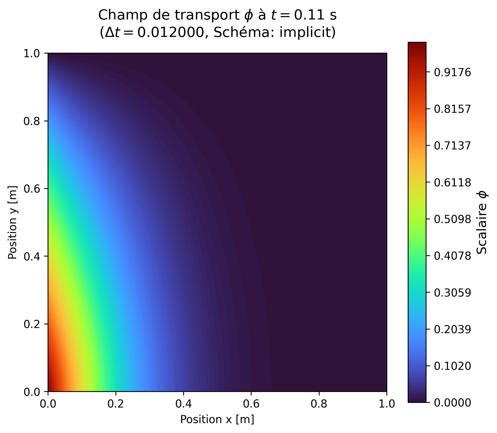
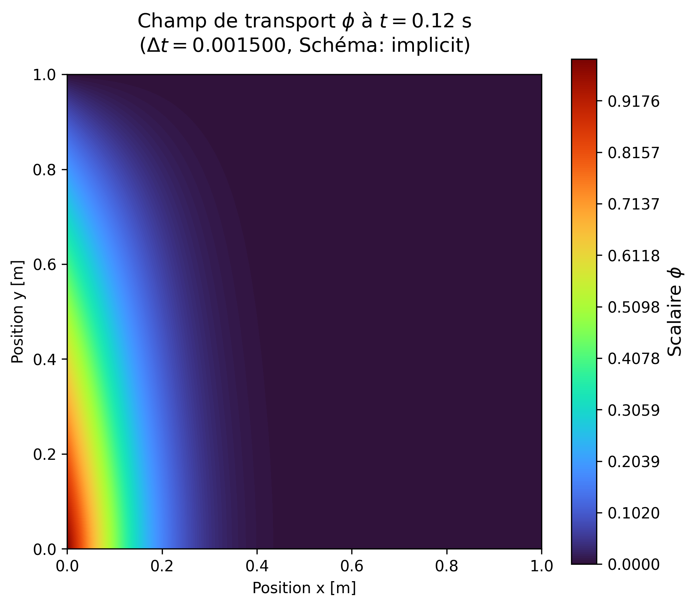
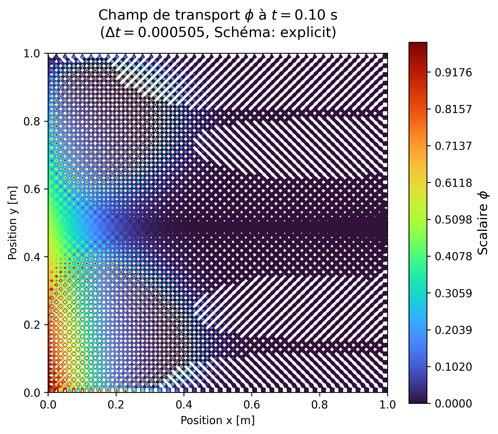
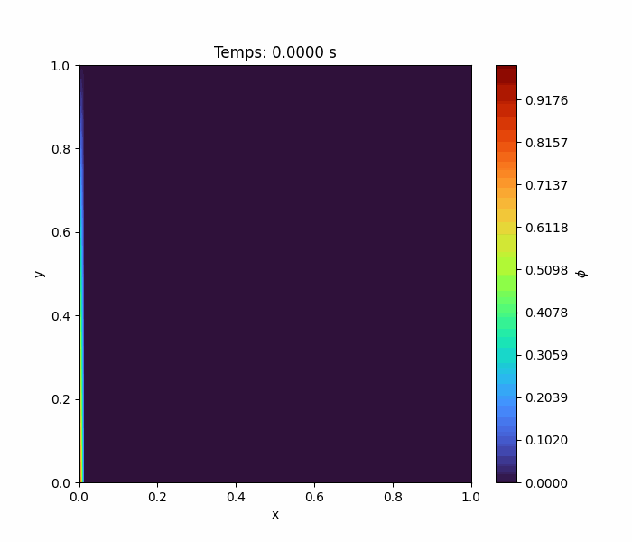
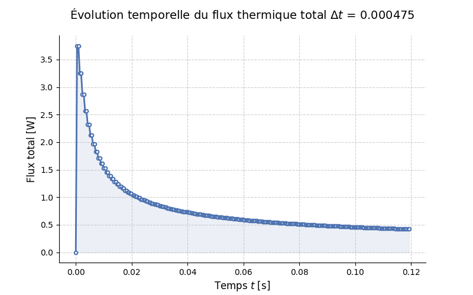
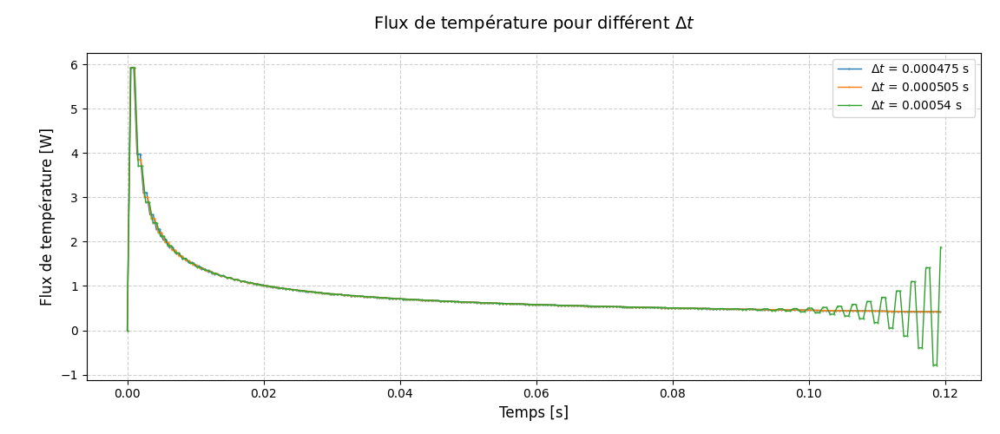
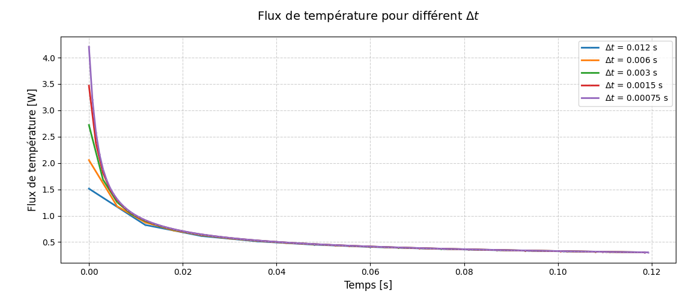

# Devoir #2 GMC767

Le code pour le devoir 2 est fait sous forme de classe Python contenant les différents solveurs discrétisé en différence centrée d'ordre 2 (CD2).

### Équation de départ
L'équation de départ est l'équation de transport pour une quantité scalaire générique $\phi$.

$$\rho \frac{\partial \phi}{\partial t} + \rho \vec{v} \cdot \nabla \phi = \Gamma (\nabla^2 \phi)$$

Celle-ci est immédiatement ré-arrangée de manière à isoler le terme temporel:
$$\frac{\partial\phi}{\partial t}=-\vec{U}\cdot\nabla\phi+\frac{\Gamma}{\rho}\left(\nabla^2\phi\right)$$

## Conditions frontières aux parois
Le domaine comprends 4 parois: N (nord), S (sud), E (est) et W (ouest)

### Paroi Nord
La frontière nord est un ***inlet*** où la quantité $\phi$ = 0. C'est une condition de type Dirichlet puisqu'on impose une quantité à l'entrée.
$$\phi = 0$$
### Paroi Sud
La frontière sud est un plan de symmétrie. Le gradient (dérivée) est imposé à la frontière. C'est donc une condition de type Neumann.

$$\frac{\partial \phi}{\partial y} = 0$$

### Paroi Ouest
La paroi ouest est une paroi de type mur où une quantité $\phi$ est imposée. C'est donc une condition de type Dirichlet. Le long du mur, la valeur de $\phi$ varie de la manière suivante:
$$\phi(y)=1 - y$$
### Paroi Est
La paroi est est une frontière de type ***outlet***. Donc une condition de type **Neumann** où le gradient de $\phi$ est imposé de la manière suivante:

$$\frac{\partial \phi}{\partial x} = 0$$


<div align=center>
    <h3>Domaine de calcul et conditions frontières</h3>
    
</div>

## Discrétisation des termes spaciaux pour la convection et diffusion


### Terme convectif
$$C=\vec{U}\cdot\nabla\phi = u \frac{\partial \phi}{\partial x} + v \frac{\partial \phi}{\partial y}$$

En prenant une dimension, on discrétise ainsi: 
$$\frac{\partial\phi}{\partial x}=\frac{\phi_{i+1}-\phi_{i-1}}{2\Delta x}$$

Pour simplifier le code, la discrétisation est traitée ainsi (pour une dimension):

$$C_x = \frac{u}{2\Delta x}(\phi_{i+1} - \phi_{i-1})$$

### Terme diffusif
$$ D=\frac{\Gamma }{\rho}(\nabla^2 \phi)= \frac{\Gamma }{\rho} \left( \frac{\partial ^2\phi}{\partial x^2} + \frac{\partial ^2\phi}{\partial y^2} \right) $$

En discrétisant pour x, on obtient: 

$$\frac{\partial ^2\phi}{\partial x^2}=\frac{\phi_{i+1}-2\phi_i+\phi_{i-1}}{2\Delta x} $$

Pour simplifier le code, la discrétisation est traitée ainsi (pour une dimension):

$$D_x=\frac{\Gamma }{\rho \cdot 2\Delta x}(\phi_{i+1}-2\phi_i+\phi_{i-1}) $$

## Terme résiduel
$$R(\phi^n) = \frac{\partial\phi^n}{\partial t} = -\vec{U}\cdot\nabla\phi^n + \frac{\Gamma}{\rho}(\nabla^2\phi^n)$$

## Discrétisation des conditions frontières

### Paroi Nord

$$\phi (x,y=1)=0 \quad \Rightarrow \quad \phi_{i,N_y} =0$$

### Paroi Sud
Condition de type Neumann: $\frac{\partial \phi}{\partial y} \vert_{y=0}=0$

On utilise le schéma de discrétisation d'ordre 2 *forward* pour obetnir la dérivée à la frontière $y=0$

$$\frac{\partial \phi}{\partial y} \vert_{y=0}=\frac{-3\phi_{i,1}+4\phi_{i,2}-\phi_{i,3}}{2\Delta y}=0 \quad \Rightarrow \quad -3\phi_{i,1}+4\phi_{i,2}-\phi_{i,3} =0$$

On obtient alors $\phi$ à la frontière: $$ \quad \phi_{i,1}=\frac{4\phi_{i,2}-\phi_{i,3}}{3} $$

### Paroi Ouest

$$\phi (x=0,y)=1-y \quad \Rightarrow \quad \phi_{0, j} =1-y_j$$

### Paroi Est

De la même manière que la paroi sud, la dérivée est prise à la frontière $x=L$ avec un schéma forward d'ordre 2:


$$\frac{\partial \phi}{\partial x} \vert_{x=L}=\frac{3\phi_{N,j}-4\phi_{N-1,j}+\phi_{N-2,j}}{2\Delta x}=0 \quad \Rightarrow \quad 3\phi_{N,j}-4\phi_{N-1,j}+\phi_{N-2,j} =0$$

On obtient alors $\phi$ à la frontière:

$$\phi_{N,j}=\frac{4\phi_{N-1,j}-\phi_{N-2,j}}{3}$$

```python
def apply_boundary_conditions(self):
        # MUR SUD (y=0, j=0) -> NEUMANN (Dérivée nulle en y)
        # Formule ordre 2 : phi_0 = (4*phi_1 - phi_2) / 3
        # On modifie la ligne du bas (j=0) en utilisant les lignes j=1 et j=2
        self.phi[:, 0] = (4.0 * self.phi[:, 1] - 1.0 * self.phi[:, 2]) / 3.0

        # MUR EST (x=Lx, i=-1) -> NEUMANN (Dérivée nulle en x)
        # Formule ordre 2 : phi_N = (4*phi_N-1 - phi_N-2) / 3
        # On modifie la colonne de droite (i=-1) en utilisant i=-2 et i=-3
        self.phi[-1, :] = (4.0 * self.phi[-2, :] - 1.0 * self.phi[-3, :]) / 3.0

        # MUR OUEST (x=0, i=0) -> DIRICHLET
        # Condition : phi = 1 - y
        # On applique sur toute la colonne de gauche
        self.phi[0, :] = 1.0 - self.y

        # MUR NORD (y=Ly, j=-1) -> DIRICHLET
        # Condition : phi = 0
        # On applique sur toute la ligne du haut
        self.phi[:, -1] = 0.0
```


## Algorithme explicite et implicite


### Méthode explicite
Pour la méthode Euler explicite, on a 
$$\phi^{n+1} = \phi^n + \Delta t \cdot R(\phi^n)$$
À chaque pas de temps, le terme $\Delta t \cdot R(\phi^n)$ est additionné au résultat précédent. Ce terme est composé des termes ***C*** et ***D*** qui sont respectivement les opérateurs de convection et diffusion obetnus par les méthodes `build_convection_term()` et `build_diffusive_term()`. Ces termes, sous forme de matrice, représentent les coefficients des points intérieurs multipliant ensuite le vecteur $\phi^n$. Cette méthodologie est conforme à la section 3.8, fig 3.6 de Ferziger et al., *"Computational Methods for Fluid Dynamics"*.

$$R(\phi^n)=(D-C) \cdot \phi^n$$

Les points aux frontières étant imposés, ils ne sont pas gérés par les méthodes `build_convection_term()` et `build_diffusive_term()`. La méthode `apply_boundary_conditions()` s'occupe de les appliquer sur le résultats de la multiplication ($\phi^{n+1}$)

<div align=center>
    <h3>Système d'équation algébrique sous forme matricielle</h3>
    
</div>

Ici le code est simplifié pour montrer la logique de résolution de la boucle de résolution temporelle à l'intérieur de la méthode `solve_explicit()` La méthode `apply_boundary_conditions()` vient appliquer les conditions limites directement sur le champ ``self.phi`` de la classe

```python
for n in range(n_steps):
            phi_flat = self.phi.flatten()   # phi mis sous forme vectorielle
            rhs = (D - C).dot(phi_flat)
            
            self.phi += dt * rhs.reshape((self.nx, self.ny))

            # On impose les conditions aux limites
            self.apply_boundary_conditions()

```


### Méthode implicite
Le méthode implicite est décrite de la manière suivante: 

$$\phi^{n+1} = \phi^n + \Delta t \cdot R (\phi^{n+1})$$
Comme précédemment,

$$R(\phi^{n+1})=(D-C) \cdot \phi^{n+1}= K \cdot \phi^{n+1}$$

On obtient alors

$$\phi^{n+1} = \phi^n + \Delta t \cdot K\phi^{n+1}$$

En mettant $\phi^{n+1}$ en évidence,

$$\phi^n = \phi^{n+1} [I-K\Delta t]=A\phi^{n+1}$$

Avant d'entrer dans la boucle de résolution, les conditions limites sont appliquées à la matrice **A** à par la méthode `replace_rows_A_matrix()`. On résoud alors $A \phi^{n+1}=\phi^n$ pour trouver $\phi^{n+1}$, $\phi^{n}$ étant connu. Dans la boucle de résolution les conditions limites sont imposées au vecteur $\phi^n$ avant chaque pas à l'aide de la méthode `replace_b()` afin de bien respecter les conditions imposées.

La méthode `solve_implicit()` simplifiée:

```python
def solve_implicit(self, dt, t_end, plot_every=5):
        C = self.build_convection_term()
        D = self.build_diffusive_term()
        
        # Construction de l'opérateur A = I - (dt/rho)*(D - C)
        I = eye(self.n_total, format='lil')
        A = I - dt * (D - C)
        A = A.tolil()

        A_csr = self.replace_rows_A_matrix(A)

        # Boucle temporelle
        n_steps = int(t_end / dt)
        print(f"Début de la simulation : {n_steps} pas de temps.")

        for n in range(n_steps):
            b = self.phi.flatten()  # Solution actuelle mise sous forme de vecteur
            b = self.replace_b(b)   # Imposition des conditions limites

            phi_new = spsolve(A_csr, b)
            
            self.phi.flat[:] = phi_new

        return self.phi
```


## Implémentation des schémas
#### Méthode implicite
<table align='center'>
  <tr align='center' cellspacing="0" cellpadding="0" style="border-collapse: collapse; border: none;">
    <td style="padding: 0; margin: 0;"></td>
    <td style="padding: 0; margin: 0;"></td>
    <td style="padding: 0; margin: 0;"></td>
  </tr>
  <tr align='center' cellspacing="0" cellpadding="0" style="border-collapse: collapse; border: none;">
    <td style="padding: 0; margin: 0;"></td>
    <td style="padding: 0; margin: 0;"></td>
  </tr>
  
</table>

#### Méthode explicite
Pour la méthode epxlicite, on peut voir que le résultat pour $\Delta t$=0.000505 s est inconcluant, cela est causé par un manque de convergence de la solution, tel qu'expliqué dans les prochaines sections.
<table align='center'>
  <tr align='center' cellspacing="0" cellpadding="0" style="border-collapse: collapse; border: none;">
  <tr align='center' cellspacing="0" cellpadding="0" style="border-collapse: collapse; border: none;">
    <td style="padding: 0; margin: 0;"></td>
    <td style="padding: 0; margin: 0;"></td>
  </tr>
  
</table>


## Évolution spatio-temporelle
</imgx>


## Flux de température
Le flux de température intégré le long du mur ***Ouest*** est décrit selon l'équation suivante:

$$-\Gamma \int_{y=0}^{y=1} \left(\frac{\partial \phi}{\partial x}\right)_{x=0} dy = f(t)$$

L'intégration est faite via la méthode `get_temperature_flux()` qui utilise les solutions stockées dans `self.phi_solution_time=` et les temps `self.time_steps`

La dérivée $\frac{\partial \phi}{\partial x}$ est faite en en utilisant la différence finie de 2e ordre *backward*

$$\frac{\partial\phi}{\partial x} \approx \frac{3\phi_i - 4\phi_{i-1} - \phi_{i-2}}{2\Delta x}$$

```python
def get_temperature_flux(self):
        dx = self.dx
        gamma = self.gamma
        x_i = 0
        f_t = []

        for i in range(len(self.time_steps)):
            phi = self.phi_solution_time[i]

            # Dérivée 2e ordre backward
            dphi_dx_ti = (-3 * phi[x_i,:] + 4 * phi[x_i+1,:] - phi[x_i+2,:]) / (2*dx)
            # Intégrale le long de y
            integral_y = np.trapz(dphi_dx_ti, self.y)
            f_t.append(-gamma * integral_y)

        return f_t
```
<div align='center'>

</div>

### Flux de température à différents dt, méthode explicite

<div align="center">

#### **Flux de température à très petits $\Delta t$ (Détail haute résolution)**

| Pas de temps ($\Delta t$) [s] | Flux thermique total à t=0.12 s [W/m] |
| :--------------------------: | :-------------------------------: |
|          0.0004750           |            0.41695738             |
|          0.0005050           |            0.41783299             |
|          0.0005400           |            1.87562987             |

</div>

<div align='center' width=400px>

</div>

### Analyse

Pour schéma Euler explicite, on constate que la solution est stable pour $\Delta t=0.000475 \,s \quad \text{et} \quad \Delta t=0.000505 \,s \quad\text{mais diverge pour } \quad \Delta t= 0.000540\,s.$

La CFL pour Euler explicit est definie de la façon suivante: 

- Advection : $\sigma_c=\frac{c\Delta t}{\Delta x} \leq 1 \Rightarrow \Delta t \leq \frac{\Delta t}{c} $

- Diffusion : $\sigma_d=\frac{\Gamma \Delta t}{\rho \Delta x^2} \leq \frac{1}{4} \Rightarrow \Delta t \leq \frac{\rho \Delta x^2}{4\Gamma} $

Donc $\Delta t\leq min\left(\frac{\Delta x}{u},\frac{\rho \Delta x^2}{4 \Gamma }\right) $

$c=\sqrt{1^2+1^2}=\sqrt{2} \quad \text{d'où }\quad \Delta t_{théorique} \leq 0,000469\,s$

On s’attendrait donc à obtenir une solution divergente pour $\Delta t = 0.000505\,s$, ce qui n’est pourtant pas observé numériquement. Cette différence s’explique par le fait que l’analyse de Von Neumann suppose un domaine infini (et généralement périodique), alors que notre domaine de calcul est fini. Cette hypothèse théorique modifie légèrement la limite de stabilité par rapport au cas réel discret étudié.


### Flux de température à différents dt, méthode implicite
<div align="center">


| Pas de temps ($\Delta t$) [s] | Flux thermique total à t=0.12 s [W/m] |
| :--------------------------: | :-------------------------------: |
|           0.01200            |            0.31485209             |
|           0.00600            |            0.30916218             |
|           0.00300            |            0.30643688             |
|           0.00150            |            0.30510264             |
|           0.00075            |            0.30444244             |

</div>

<div align='center' width=400px>

</div>


